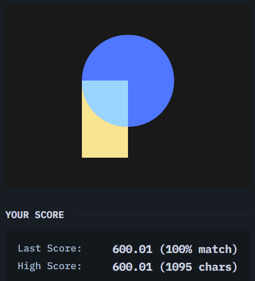

<h1>CSS Battles</h1>

This <a href="https://cssbattle.dev/">platform</a> contains various challenges for developers to take up in order to improve their CSS skills.

This repository contains solutions for the same.

<h3>Completed Challenges</h3>

  
  
  
  
  

